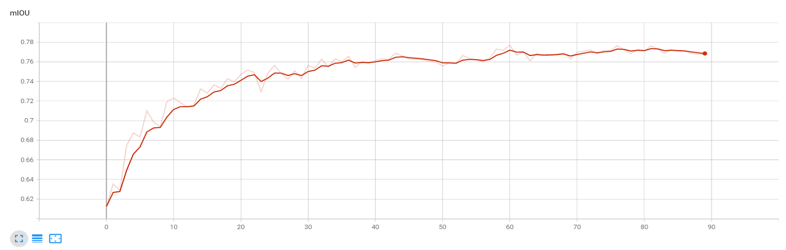
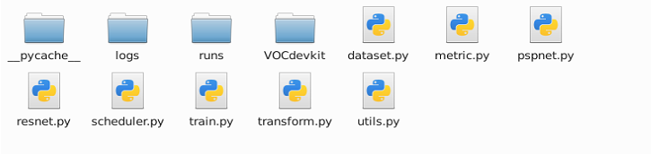

# PSPNet

#### BackBone: Resnet50s
#### use auxiliary loss: False
#### train epoch: 80
#### best mIOU: 78%
#### dataset: PASCAL 2012 Aug

# Version

#### RTX2080Ti * 2
#### Cuda Version: 10.2
#### Pytorch Version: 1.7.0

# How to Train Local

#### download the VOCdevkit(it contains the VOC2012)
#### run train.py

# Project Structure

